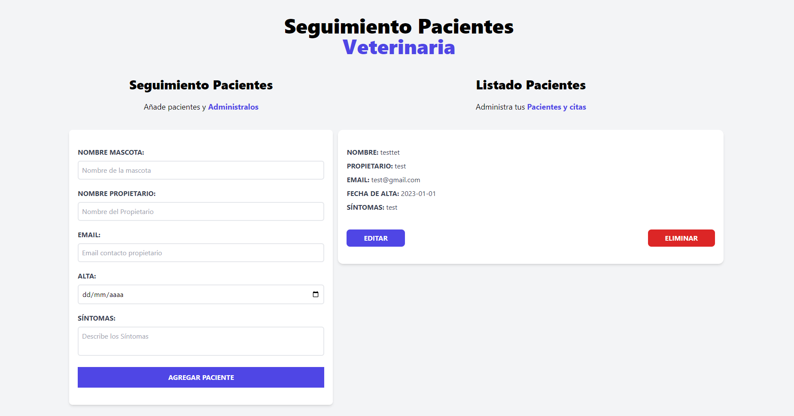

# Front-create-quotes

## Descripción
Aplicacion creada para tener una administracion de citas, asimismo esta informacion se guardara en el localStorage, asi que la app, es optima localmente.

## Organisms
### Form
Se brinda todo el formulario de la page, donde funciona para enviar y actualizar la data.

## Header
Lleva el titular de la page.

## ListPatients
Se muestra el listado de los pacientes, asimismo aca se muestra los botones de editar y eliminar

## Template && Page
### App
Aca es donde se junta todos los componentes anteriores, y asimismo se muestra.

## Helpers
**`generateId`**: Brinda un id unico
